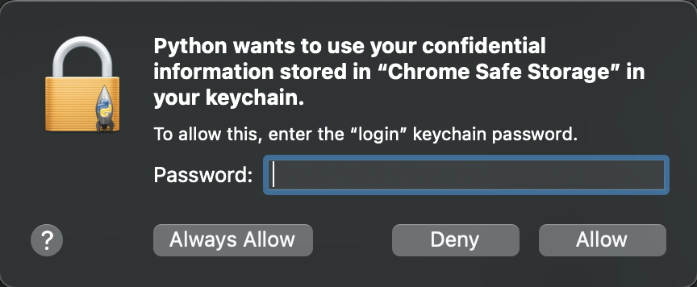

# ESPN-Fantasy-Football-Free-Agent-Automation

This program is intended as a very simple implementation to allow obsessed fantasy players to get more sleep. If you are like me and you have found yourself pursuing free agent trades at 5am, consider that course of action no longer! 

This program queries the ESPN API until desired player is a free agent. Once this occurs, testing software (selenium) is used to sign in to the ESPN fantasy website and add the desired player.

There is quite a bit left to do, and progress has slowed somewhat after I discovered that my league settings this year update waiver position weekly based on performance (meaning there is little benefit to adding from free agency vs. claiming from waivers). 

# Usage
On running the program, it will check if the cookies file (for querying ESPN) and the ESPN league info file (for storing information about your league) exist. 

If the cookies file does not exist, the library *browser_cookie* is used to collect relevant cookies from Chrome. This may prompt you for permission (especially if you are on Mac). 



To get the ESPN league info, login to your team page and collect the URL. Input this when prompted. In the following example, the X's would be replaced with your relevant infroamtion.

```angular2html
https://fantasy.espn.com/football/team?leagueId=XXXXXXXXXX&teamId=X&seasonId=XXXX
```

Next, input username and password. These will not be stored for security purposes.

After this, you are prompted to specify the date for the transaction to occur. As this is designed to allow you to schedule transactions in advance, it is up to you when these occur. Format example:

```angular2html
What day should this be scheduled for? 9/28
```

Finally, the player(s) to add and drop are to be input. This should be a comma-separated list of names with each index corresponding to the players involved in that particular transaction. In the following example, Harrison Butker will be added and Nick Folk will be dropped. Similarly, Najee Harris will be added and Jonathan Taylor will be dropped. 

```angular2html
Input players to add: Harrison Butker, Najee Harris
Input players to drop: Nick Folk, Jonathan Taylor
```

Now user input is finished! The program will now pause until we reach the specified date.

At 3 am on that date, the program will begin querying ESPN to determine if the first transaction is yet a free agent. Until this occurs, it keeps querying every 5 minutes. 

Once the player is a free agent, testing software (Selenium) will open a chrome browser, sign in to the user account, and perform the requested transaction. Any issues will cause that transaction to be aborted. 

The player is now yours without having to use a waiver!

# Library Dependencies
pandas 1.5.0

selenium 4.4.3

browsercookie 0.7.7

# TODO
- Create GUI for inputting information
- Rerun is_free_agent until the api retries exceeded error occurs again.
  Adjust the except clause to only include this error.
- Add capability to handle adding (rather than just swapping)
- Figure out how to determine if defense is a free agent
